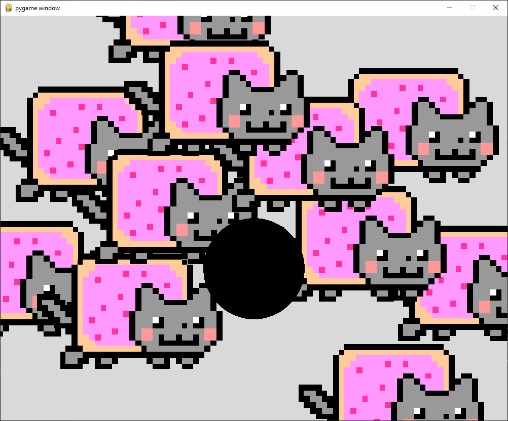

<h1>
Cat and Physics
</h1>

Cat Physics started as a playful exploration of real-world physics, particularly gravity, during my physics class. Learning about Newton's gravity equation sparked my curiosity, and I stumbled upon a fascinating video of scientists experimenting on cats in zero gravity to see if they could still land on their feet.

Intriguingly, the cats in zero G struggled to land on their paws. Scientists suggested that without the constant pull of gravity, the cats' biological responses couldn't adjust to weightlessness. This raised a challenging question: how could I accurately mimic gravity and its effects on collisions in a digital world?

Thus, Cat Physics was born. Building upon pre-existing code, I focused on four key elements:

1. Creating the Space: First, I needed a virtual environment where objects could interact with gravity. This involved defining the physics simulation and its parameters.

2. Introducing the Objects: I chose the iconic rainbow cat GIF as my main character and a static black ball for collisions. Each object needed its own physical properties and behaviors.

3. Initiating the Game: A game needs a starting point, so I built an initializer that sets the stage for the simulation and allows you to begin playing.

4. Experiencing Gravity: With a simple click, the rainbow cat would materialize and fall under the simulated gravity (adjustable in the settings). Collisions with the black ball would then occur, showcasing the gravity's effect on both objects.

The cat physics game was the first game that I ever created with lots of help with many of different resources thanks to creators and other developers that assisted with developing this code.

My future plans include expanding the scope of Cat Physics. Imagine being able to choose gravity from different planets and witness the cat's unique movements under varying gravitational forces!

Here is the code:

```{python}
# pymunk
# Create a 2d space for which physics will be observed within.
# Physical objects, body an atom what is affected by physics
# Shape an area around the body that can collide
# no visual
# pygame allows to display these physics
# Chester Leoso
#

from tkinter import CENTER
from turtle import position, shape, shapetransform
from webbrowser import get
import pygame
import sys
import pymunk  # importing modules

# create objects that will experience the falling
def createApple(space, pos):
    # Diff types of bodies in pymunk
    # Static body, a body that doesn't move but other bodies can collide with it (circles)
    # Dynamic body, a body that can be moved by physics
    # mass(weight)
    # inertia(resistance to movement)
    # body-type(what body type we want)
    # Kinematic body, a body that can be moved by the player (or other non-physical code)
    body = pymunk.Body(1, 100, body_type=pymunk.Body.DYNAMIC)
    body.position = pos
    shape = pymunk.Circle(body, 100)  # create a circle physical object
    space.add(body, shape)  # add to space
    return shape

# drawing or developing the space
def drawApple(apples):
    for apple in apples:
        positionX = int(apple.body.position.x)
        positionY = int(apple.body.position.y)
        appleRect = appleSurface.get_rect(center=(positionX, positionY))
        screen.blit(appleSurface, appleRect)

# create static object to act as collision
def staticBall(space):
    # fixed position within space
    body = pymunk.Body(body_type=pymunk.Body.STATIC)
    body.position = (500, 500)
    shape = pymunk.Circle(body, 100)
    space.add(body, shape)
    return shape

# draw static balls
def drawStaticBall(balls):
    for ball in balls:
        positionX = int(ball.body.position.x)
        positionY = int(ball.body.position.y)
        pygame.draw.circle(screen, (0, 0, 0), (positionX, positionY), 100)


pygame.init()  # initiating pygame
screen = pygame.display.set_mode((1000, 800))  # creating the display surface
clock = pygame.time.Clock()  # creating the game clock
space = pymunk.Space()  # the 2d physical space
space.gravity = (0, 20)  # the horizontal gravity x, vertical gravity y
# apples
apples = []  # empty list
# static balls
balls = []
balls.append(staticBall(space))
appleSurface = pygame.image.load('cat.gif')

while True:  # game loop
    for event in pygame.event.get():  # checking for user input
        if event.type == pygame.QUIT:  # if input is to close the game
            pygame.quit()
            sys.exit()
        if event.type == pygame.MOUSEBUTTONDOWN:
            apples.append(createApple(space, event.pos))

    screen.fill((217, 217, 217))  # background color
    drawApple(apples)  # draws the apples
    drawStaticBall(balls)  # draw the static balls
    # update 0.02seconds, every time we update the screen we update the simulation
    space.step(1 / 50)
    pygame.display.update()  # rendering the frame
    clock.tick(120)  # limiting the frames per second to 120

```

<h3>
Weightless Cats - Do Space Cats Land On Their Feet?
</h3>

[
