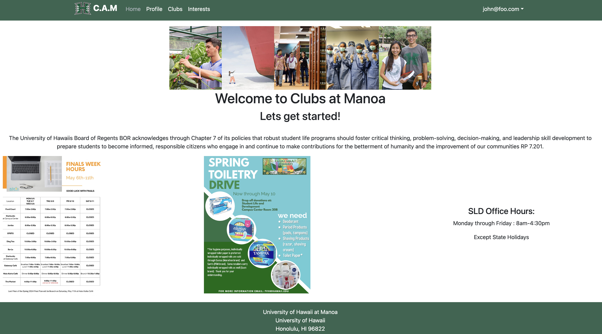
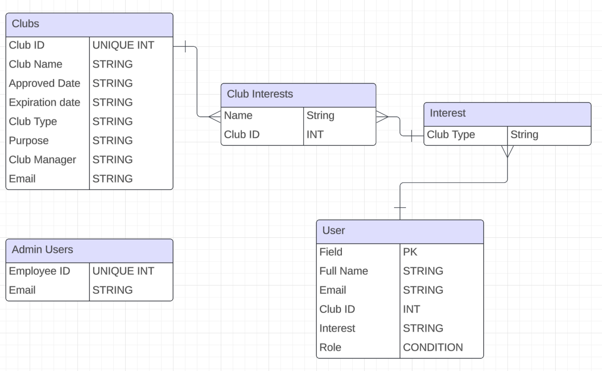

##Intro
The problem: UH Manoa has over 200 Registered Independent Organizations, plus many more that do not have this “official” status but are nonetheless active organizations. Unfortunately, there is no easy way for students to learn (a) what student clubs (both registered and unregistered) exist, what they do, and how to get further involved.

The solution: The Club Hub application will provide a centralized directory for UH Manoa student clubs. UH Manoa students can log in to browse a well-organized directory of all current student clubs, with brief descriptions, meeting times and locations, URLs to their websites (if any), contact information for officers, and a few select photos.

We decided to use a template that would assist us the most, a template created by the Computer Science College at the University of Hawaii at Manoa school: <a href="https://github.com/ics-software-engineering/meteor-application-template-react"/>

## Designing Approach

In the course of the project, we decided first to check the requirements of the project and then take a behavioral approach towards developing a schema or plan of action. Similar to real life, the requirements were indeed very broad and not very detailed. It left us to interpret the best course of actions since the functions that were requested by the project details required us to think of the behavior of not just the function but the user as well.

At first, this stumped our team, for several reasons. The first was because of the broad requirements; it left us to assume a lot of what was being expected of us. For example, one of the requirements was that users that visited the site were able to see all the clubs associated with the RIO of the University, however, it was not clear about what we should be able to showcase to visitors of the site. The second reason we were stumped was how we were going to implement the code.

Therefore, we took to the internet and looked up the actual RIO website for the University of Hawaii at Manoa. We found a CSV file that hosts all the clubs that are active. This showed us fields that the database thought to be important such as interest type, name of the club, description, and dates of expiration. In that moment, we received our answer about what information would be displayed for all visitors to the site and what data fields would not be as important.

## Concept

Once we had that information, we were able to develop a skeleton of the website and from there decided the behavior of each page and how it would treat users. We were able to categorize three different types of users: regular account holders, club managers that are owners of a club, and admin accounts that had access to all information on the website. Therefore, we had to treat each user's experience differently, and thus each user's web application behaved differently.

After treating every user's experience differently, we were able to develop the links, options, and functions to the website that were appropriate for each user. For example, every visitor to the site is able to see all the clubs that are available, but users that login have a different experience since they will be able to create a profile and sign up for clubs through the website. Furthermore, the admin will be able to edit all profiles and align profiles to certain clubs as club managers. So, therefore, all subscribers can be club managers, but they will only have access to edit the profile of their club if the admin assigns the club to that user.

## GitHub Nightmare

If there was anything about this project that was indeed probably the most difficult thing to do, it was updating the branches to our GitHub. Since working with a team and different schedules, we were tasked with issues within our GitHub project, and each person assigned was able to create branches and push to the main. However, implementation of these edits conflicted with many of the codes that other members created. One such example was when we were attempting to develop a navbar link in which the navbar would show certain items and certain links depending on the user's roles on the website. This navbar, though, required a route path, which was assigned an ID. Therefore, the navbar depended on another file to develop the path and ID so that when called, the navbar could populate that link to the page. However, each member assigned the ID name with something else and pushed to main. This caused the navbar to basically break or the code to run into errors.

## Results

Overall, the experience of working with teams, developing, and implementing a web application takes deep knowledge and good planning to execute not just a functioning web application but also to develop a great app. Therefore, the most important part of the entire project is in the beginning, sticking to a very detailed plan and breaking that plan up into smaller executable pieces. Breaking the project into file by file and designing the files in such a way that once created will work with another file would've drastically changed our effort time periods and website overall. Thus, in future iterations of coding projects or any projects, the skill is to know how each component works in developing the final product and one way to start is by breaking the project up piece by piece.

