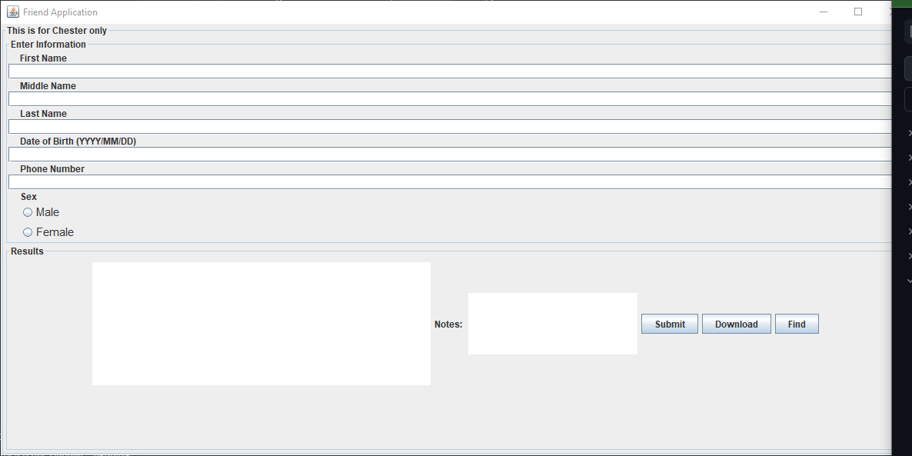

My second semester of college sparked a passion for database development and building algorithms for intriguing predictions. This passion gave birth to the "Friend App," a project that started as a personal challenge to test my fledgling app-building skills. Initially, it was just a desktop application designed to store and track information about my friends. While incomplete, it marked my first foray into real-world application development.

Then, I stumbled upon the fascinating world of machine learning and, specifically, generative models. Their complexity captivated me, and I envisioned their integration into my Friend App. I embarked on a journey to discover how these neural networks could be used to "find" something within the data. But what exactly was I searching for? What predictions did I want to make? This contemplation led me to the core purpose of my project: predicting the characteristics and even the existence of a new friend based on the data I had already gathered.

To achieve this, I needed a solid foundation. I crafted a Java object model representing a "friend" and built a graphical user interface (GUI) using Java Swing (the "outdated" aspect hinting at potential future library exploration). This app diligently saved all friend data in a CSV file, paving the way for Python to take over. With Python as my tool, I prepared to feed the data into the generative model and unveil the predicted traits of my future friend.


Here is the java object class code for the object Friend
```java
import javax.swing.JFrame;
import javax.swing.JOptionPane;
import java.time.LocalDate;
import java.time.format.*;

/**
 * 
 * Description: The class that creates a Friend object in which will be stored.
 * Further it will throw custom exception to produce custom messages.
 * 
 * @author Chester Leoso
 * @date 05/25/2022
 * @version 1.0.9
 * @dmodified 10/31/2023
 */

public class Friend {

    // variables only seen in Friend Class
    private String fName = ""; // first name
    private String lName = ""; // last name
    private String mName = ""; // middle name
    private String sex = ""; // sex
    private LocalDate dob; // dob of birth
    private String phone = ""; // phone number
    private String notes = ""; // notes

    // Constructor of friend object which would set the following information
    Friend(String fName, String mName, String lName, String dob, String sex, String phone, String notes)
            throws FriendException {
        this.validateName(fName, lName, mName);
        this.setSex(sex);
        this.setDOB(dob);
        this.setPhone(phone);
        this.setNotes(notes);
    }

    // accessor methods
    public String getLastName() {
        return this.lName;
    }

    public String getFirstName() {
        return this.fName;
    }

    public String getMiddleName() {
        return this.mName;
    }

    public String getSex() {
        return this.sex;
    }

    public LocalDate getDOB() {
        return this.dob;
    }

    public String getNotes() {
        return this.notes;
    }

    public String getPhone() {
        return this.phone;
    }

    // mutator methods
    // validates name
    public void validateName(String newFName, String newLName, String newMName) throws FriendException {
        if (newFName.isEmpty() || newLName.isEmpty() || newFName.length() == 1 || newLName.length() == 1) {
            FriendException fre = new FriendException();
            JOptionPane.showMessageDialog(new JFrame(),
                    "First and last name must be at least 2 characters long and not empty.",
                    "Name Validation Error", JOptionPane.ERROR_MESSAGE);
            throw fre;
        } else if (!newFName.matches("[a-zA-Z -]+") || !newLName.matches("[a-zA-Z -]+")) {
            FriendException fre = new FriendException();
            JOptionPane.showMessageDialog(new JFrame(), "First and last name cannot contain a number(s).",
                    "Name Validation Error", JOptionPane.ERROR_MESSAGE);
            throw fre;
        } else {
            fName = newFName;
            lName = newLName;
            if (newMName.matches("[a-zA-Z -]+") && newMName.length() > 1) {
                mName = newMName;
            }
        }
    }

    // set sex
    public void setSex(String sex) throws FriendException {
        if (!sex.equalsIgnoreCase("male") && !sex.equalsIgnoreCase("female")) {
            FriendException fre = new FriendException();
            JOptionPane.showMessageDialog(new JFrame(), "Sex must be either male or female.",
                    "Sex Validation Error", JOptionPane.ERROR_MESSAGE);
            throw fre;
        } else {
            this.sex = sex;
        }
    }

    // validate date of birth
    public void setDOB(String dob) {
        try {
            DateTimeFormatter formatter = DateTimeFormatter.ofPattern("yyyy/MM/dd");
            LocalDate date = LocalDate.parse(dob, formatter);
            // set the dob instance variable to the parsed LocalDate object
            this.dob = date;
        } catch (DateTimeParseException dobException) {
            JOptionPane.showMessageDialog(new JFrame(),
                    "The date of birth format is incorrect ensure that your input is YYYY/MM/DD",
                    "date date invalid",
                    JOptionPane.ERROR_MESSAGE);
            return;
        }
    }

    // validates phone number for each user entered
    public void setPhone(String phone) throws FriendException {
        // if it is a valid phone number then it will set the phone number
        if (isValidPhoneNumber(phone)) {
            this.phone = phone;
        } else {
            // throws an exception
            FriendException fre = new FriendException();
            JOptionPane.showMessageDialog(new JFrame(), "Phone number should be equal to 10 digits.",
                    "phone number validator", JOptionPane.ERROR_MESSAGE);
            throw fre;
        }
    }

    // boolean method to validate phone number
    private boolean isValidPhoneNumber(String phone) {
        /*
         * validation logic,
         * only validates if input is all digits and that has a specific length
         */
        return phone.matches("\\d{10}"); // has 10 digits
    }

    // validate notes
    public void setNotes(String notes) {
        // takes in all text
        this.notes = notes;
    }

    // output using string builder
    public String toString() {
        StringBuilder sb = new StringBuilder();
        sb.append("Name: ").append(this.fName).append(" ").append(this.mName).append(" ").append(this.lName)
                .append("\n");
        sb.append("Sex: ").append(this.sex).append("\n");
        sb.append("DOB: ").append(this.dob).append("\n");
        sb.append("Notes: ").append(this.notes).append("\n");
        sb.append("Phone number: ").append(this.phone).append("\n");
        return sb.toString();
    }

}
```
