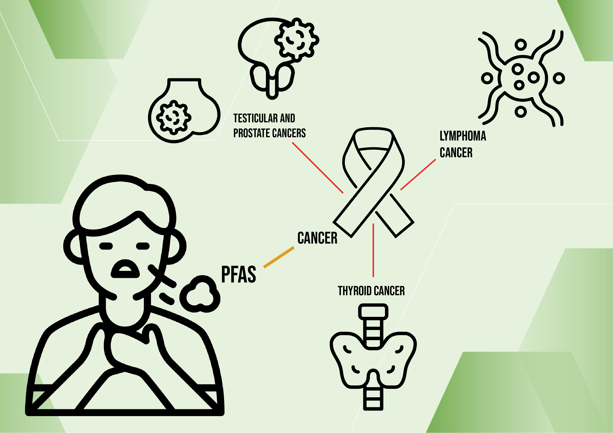
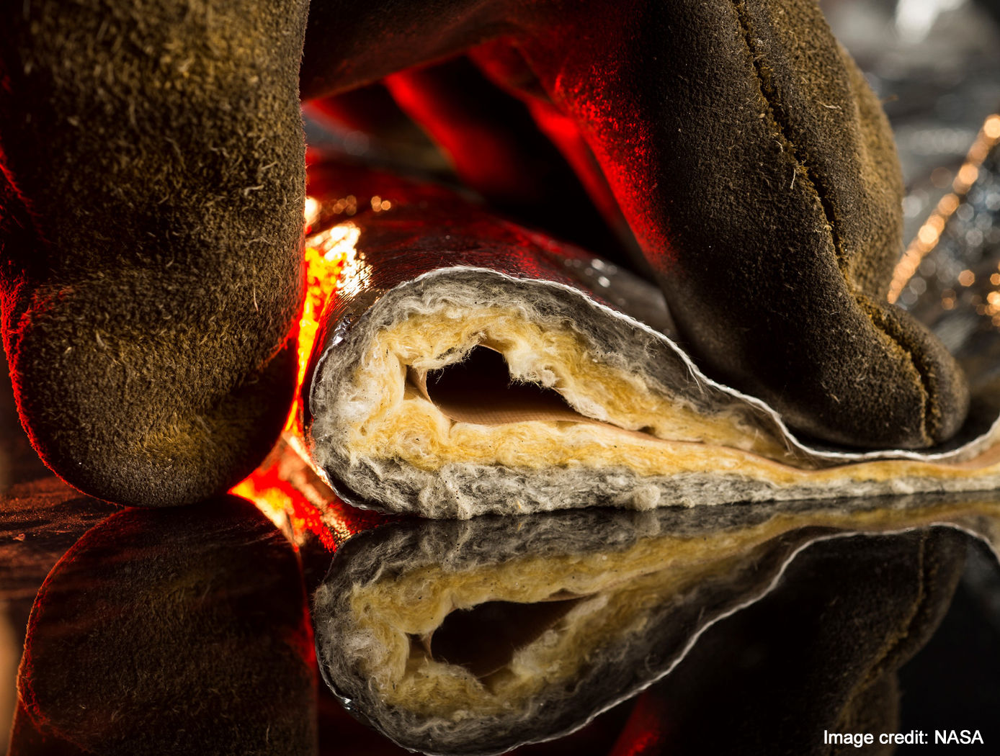

My journey with the NASA MITTIC competition began with a simple question: how can we improve the lives of firefighters through innovative technology? This project has become more than just a competition; it's a passion project fueled by a desire to make a real difference in the world.

From the start, we knew traditional fireproof gear needed an upgrade. That's why we focused on two key innovations:

Safer Materials: Ditching the harmful PFAs found in common firefighting suits was a non-negotiable priority. We've explored alternative coating materials that offer similar fire resistance without posing the same cancer risks to firefighters.
Smarter Technology: Introducing smart textiles into the equation elevates the game. These fabrics actively communicate with technology, potentially giving firefighters valuable real-time data in the heat of the moment.
Our market research underscored the urgent need for fireproof gear that prioritizes comfort, weight, flexibility, and, most importantly, safety. That's why we actively collaborated with independent consumers to design a product that meets their needs firsthand.

Eliminating PFAs isn't just a goal; it's a mission. These "forever chemicals" pose a serious health threat to firefighters through prolonged exposure. By offering a safer alternative, we aim to protect those who bravely protect us.

And the journey doesn't stop here. We're constantly exploring new solutions, pushing the boundaries of innovation to ensure firefighters have the best possible tools at their disposal. This is more than just a competition; it's a commitment to the safety and well-being of these everyday heroes.

By merging passion with technology, we're crafting a revolution in firefighter gear. Join us on this journey as we strive to make a safer, smarter future for the heroes who face the flames.

This revised version combines the content from both paragraphs into a single, cohesive narrative with a clear voice and purpose. It emphasizes the personal motivation behind the project, highlights the key innovations, and showcases the market research and commitment to safety. The tone is enthusiastic and passionate, reflecting the dedication to the project and the firefighters it aims to serve.

You can learn more about the NASA IP we selected for our proposal [Multilayered Fire Protection System](https://technology.nasa.gov/patent/LAR-TOPS-212)

You can learn more about the NASA program [NASA MITTIC website](https://www.nasa.gov/learning-resources/minority-university-research-education-project/murep-innovation-tech-transfer-idea-competition-mittic/).
